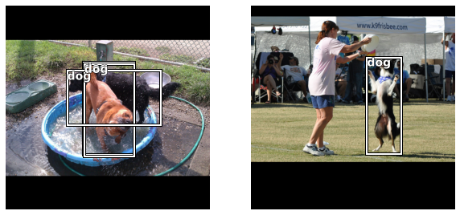

# fastai_object_detection
> Extension for <a href='https://docs.fast.ai'>fastai</a> library to include object recognition.


```
!pip install --upgrade fastai
!pip install --upgrade git+https://github.com/rbrtwlz/fastai_object_detection
```

    Requirement already satisfied: fastai in /usr/local/lib/python3.7/dist-packages (1.0.61)
    Collecting fastai
      Downloading fastai-2.4.1-py3-none-any.whl (188 kB)
         |████████████████████████████████| 188 kB 9.0 MB/s 
    [?25hRequirement already satisfied: spacy<4 in /usr/local/lib/python3.7/dist-packages (from fastai) (2.2.4)
    Requirement already satisfied: torchvision>=0.8.2 in /usr/local/lib/python3.7/dist-packages (from fastai) (0.10.0+cu102)
    Requirement already satisfied: fastprogress>=0.2.4 in /usr/local/lib/python3.7/dist-packages (from fastai) (1.0.0)
    Requirement already satisfied: scipy in /usr/local/lib/python3.7/dist-packages (from fastai) (1.4.1)
    Requirement already satisfied: packaging in /usr/local/lib/python3.7/dist-packages (from fastai) (21.0)
    Requirement already satisfied: torch<1.10,>=1.7.0 in /usr/local/lib/python3.7/dist-packages (from fastai) (1.9.0+cu102)
    Requirement already satisfied: pandas in /usr/local/lib/python3.7/dist-packages (from fastai) (1.1.5)
    Requirement already satisfied: matplotlib in /usr/local/lib/python3.7/dist-packages (from fastai) (3.2.2)
    Requirement already satisfied: pyyaml in /usr/local/lib/python3.7/dist-packages (from fastai) (3.13)
    Requirement already satisfied: pip in /usr/local/lib/python3.7/dist-packages (from fastai) (21.1.3)
    Requirement already satisfied: pillow>6.0.0 in /usr/local/lib/python3.7/dist-packages (from fastai) (7.1.2)
    Requirement already satisfied: requests in /usr/local/lib/python3.7/dist-packages (from fastai) (2.23.0)
    Collecting fastcore<1.4,>=1.3.8
      Downloading fastcore-1.3.21-py3-none-any.whl (53 kB)
         |████████████████████████████████| 53 kB 798 kB/s 
    [?25hRequirement already satisfied: scikit-learn in /usr/local/lib/python3.7/dist-packages (from fastai) (0.22.2.post1)
    Requirement already satisfied: numpy in /usr/local/lib/python3.7/dist-packages (from fastprogress>=0.2.4->fastai) (1.19.5)
    Requirement already satisfied: blis<0.5.0,>=0.4.0 in /usr/local/lib/python3.7/dist-packages (from spacy<4->fastai) (0.4.1)
    Requirement already satisfied: catalogue<1.1.0,>=0.0.7 in /usr/local/lib/python3.7/dist-packages (from spacy<4->fastai) (1.0.0)
    Requirement already satisfied: cymem<2.1.0,>=2.0.2 in /usr/local/lib/python3.7/dist-packages (from spacy<4->fastai) (2.0.5)
    Requirement already satisfied: wasabi<1.1.0,>=0.4.0 in /usr/local/lib/python3.7/dist-packages (from spacy<4->fastai) (0.8.2)
    Requirement already satisfied: preshed<3.1.0,>=3.0.2 in /usr/local/lib/python3.7/dist-packages (from spacy<4->fastai) (3.0.5)
    Requirement already satisfied: srsly<1.1.0,>=1.0.2 in /usr/local/lib/python3.7/dist-packages (from spacy<4->fastai) (1.0.5)
    Requirement already satisfied: thinc==7.4.0 in /usr/local/lib/python3.7/dist-packages (from spacy<4->fastai) (7.4.0)
    Requirement already satisfied: setuptools in /usr/local/lib/python3.7/dist-packages (from spacy<4->fastai) (57.2.0)
    Requirement already satisfied: tqdm<5.0.0,>=4.38.0 in /usr/local/lib/python3.7/dist-packages (from spacy<4->fastai) (4.41.1)
    Requirement already satisfied: murmurhash<1.1.0,>=0.28.0 in /usr/local/lib/python3.7/dist-packages (from spacy<4->fastai) (1.0.5)
    Requirement already satisfied: plac<1.2.0,>=0.9.6 in /usr/local/lib/python3.7/dist-packages (from spacy<4->fastai) (1.1.3)
    Requirement already satisfied: importlib-metadata>=0.20 in /usr/local/lib/python3.7/dist-packages (from catalogue<1.1.0,>=0.0.7->spacy<4->fastai) (4.6.1)
    Requirement already satisfied: zipp>=0.5 in /usr/local/lib/python3.7/dist-packages (from importlib-metadata>=0.20->catalogue<1.1.0,>=0.0.7->spacy<4->fastai) (3.5.0)
    Requirement already satisfied: typing-extensions>=3.6.4 in /usr/local/lib/python3.7/dist-packages (from importlib-metadata>=0.20->catalogue<1.1.0,>=0.0.7->spacy<4->fastai) (3.7.4.3)
    Requirement already satisfied: certifi>=2017.4.17 in /usr/local/lib/python3.7/dist-packages (from requests->fastai) (2021.5.30)
    Requirement already satisfied: idna<3,>=2.5 in /usr/local/lib/python3.7/dist-packages (from requests->fastai) (2.10)
    Requirement already satisfied: urllib3!=1.25.0,!=1.25.1,<1.26,>=1.21.1 in /usr/local/lib/python3.7/dist-packages (from requests->fastai) (1.24.3)
    Requirement already satisfied: chardet<4,>=3.0.2 in /usr/local/lib/python3.7/dist-packages (from requests->fastai) (3.0.4)
    Requirement already satisfied: pyparsing!=2.0.4,!=2.1.2,!=2.1.6,>=2.0.1 in /usr/local/lib/python3.7/dist-packages (from matplotlib->fastai) (2.4.7)
    Requirement already satisfied: python-dateutil>=2.1 in /usr/local/lib/python3.7/dist-packages (from matplotlib->fastai) (2.8.1)
    Requirement already satisfied: kiwisolver>=1.0.1 in /usr/local/lib/python3.7/dist-packages (from matplotlib->fastai) (1.3.1)
    Requirement already satisfied: cycler>=0.10 in /usr/local/lib/python3.7/dist-packages (from matplotlib->fastai) (0.10.0)
    Requirement already satisfied: six in /usr/local/lib/python3.7/dist-packages (from cycler>=0.10->matplotlib->fastai) (1.15.0)
    Requirement already satisfied: pytz>=2017.2 in /usr/local/lib/python3.7/dist-packages (from pandas->fastai) (2018.9)
    Requirement already satisfied: joblib>=0.11 in /usr/local/lib/python3.7/dist-packages (from scikit-learn->fastai) (1.0.1)
    Installing collected packages: fastcore, fastai
      Attempting uninstall: fastai
        Found existing installation: fastai 1.0.61
        Uninstalling fastai-1.0.61:
          Successfully uninstalled fastai-1.0.61
    Successfully installed fastai-2.4.1 fastcore-1.3.21
    Collecting git+https://github.com/rbrtwlz/fastai_object_detection
      Cloning https://github.com/rbrtwlz/fastai_object_detection to /tmp/pip-req-build-ani3tiek
      Running command git clone -q https://github.com/rbrtwlz/fastai_object_detection /tmp/pip-req-build-ani3tiek
    Collecting mean_average_precision@ git+https://github.com/bes-dev/mean_average_precision
      Cloning https://github.com/bes-dev/mean_average_precision to /tmp/pip-install-qas4t8kq/mean-average-precision_3244ecca0a7b4750a8bbb96231bb6bae
      Running command git clone -q https://github.com/bes-dev/mean_average_precision /tmp/pip-install-qas4t8kq/mean-average-precision_3244ecca0a7b4750a8bbb96231bb6bae
    Collecting torch==1.7.1
      Downloading torch-1.7.1-cp37-cp37m-manylinux1_x86_64.whl (776.8 MB)
         |████████████████████████████████| 776.8 MB 17 kB/s 
    [?25hCollecting torchvision==0.8.2
      Downloading torchvision-0.8.2-cp37-cp37m-manylinux1_x86_64.whl (12.8 MB)
         |████████████████████████████████| 12.8 MB 22 kB/s 
    [?25hRequirement already satisfied: fastai in /usr/local/lib/python3.7/dist-packages (from fastai-object-detection==0.0.1) (2.4.1)
    Requirement already satisfied: pycocotools in /usr/local/lib/python3.7/dist-packages (from fastai-object-detection==0.0.1) (2.0.2)
    Requirement already satisfied: numpy in /usr/local/lib/python3.7/dist-packages (from mean_average_precision@ git+https://github.com/bes-dev/mean_average_precision->fastai-object-detection==0.0.1) (1.19.5)
    Requirement already satisfied: pandas in /usr/local/lib/python3.7/dist-packages (from mean_average_precision@ git+https://github.com/bes-dev/mean_average_precision->fastai-object-detection==0.0.1) (1.1.5)
    Requirement already satisfied: typing-extensions in /usr/local/lib/python3.7/dist-packages (from torch==1.7.1->fastai-object-detection==0.0.1) (3.7.4.3)
    Requirement already satisfied: pillow>=4.1.1 in /usr/local/lib/python3.7/dist-packages (from torchvision==0.8.2->fastai-object-detection==0.0.1) (7.1.2)
    Requirement already satisfied: matplotlib in /usr/local/lib/python3.7/dist-packages (from fastai->fastai-object-detection==0.0.1) (3.2.2)
    Requirement already satisfied: spacy<4 in /usr/local/lib/python3.7/dist-packages (from fastai->fastai-object-detection==0.0.1) (2.2.4)
    Requirement already satisfied: requests in /usr/local/lib/python3.7/dist-packages (from fastai->fastai-object-detection==0.0.1) (2.23.0)
    Requirement already satisfied: fastcore<1.4,>=1.3.8 in /usr/local/lib/python3.7/dist-packages (from fastai->fastai-object-detection==0.0.1) (1.3.21)
    Requirement already satisfied: pyyaml in /usr/local/lib/python3.7/dist-packages (from fastai->fastai-object-detection==0.0.1) (3.13)
    Requirement already satisfied: scikit-learn in /usr/local/lib/python3.7/dist-packages (from fastai->fastai-object-detection==0.0.1) (0.22.2.post1)
    Requirement already satisfied: pip in /usr/local/lib/python3.7/dist-packages (from fastai->fastai-object-detection==0.0.1) (21.1.3)
    Requirement already satisfied: fastprogress>=0.2.4 in /usr/local/lib/python3.7/dist-packages (from fastai->fastai-object-detection==0.0.1) (1.0.0)
    Requirement already satisfied: packaging in /usr/local/lib/python3.7/dist-packages (from fastai->fastai-object-detection==0.0.1) (21.0)
    Requirement already satisfied: scipy in /usr/local/lib/python3.7/dist-packages (from fastai->fastai-object-detection==0.0.1) (1.4.1)
    Requirement already satisfied: srsly<1.1.0,>=1.0.2 in /usr/local/lib/python3.7/dist-packages (from spacy<4->fastai->fastai-object-detection==0.0.1) (1.0.5)
    Requirement already satisfied: plac<1.2.0,>=0.9.6 in /usr/local/lib/python3.7/dist-packages (from spacy<4->fastai->fastai-object-detection==0.0.1) (1.1.3)
    Requirement already satisfied: blis<0.5.0,>=0.4.0 in /usr/local/lib/python3.7/dist-packages (from spacy<4->fastai->fastai-object-detection==0.0.1) (0.4.1)
    Requirement already satisfied: setuptools in /usr/local/lib/python3.7/dist-packages (from spacy<4->fastai->fastai-object-detection==0.0.1) (57.2.0)
    Requirement already satisfied: thinc==7.4.0 in /usr/local/lib/python3.7/dist-packages (from spacy<4->fastai->fastai-object-detection==0.0.1) (7.4.0)
    Requirement already satisfied: cymem<2.1.0,>=2.0.2 in /usr/local/lib/python3.7/dist-packages (from spacy<4->fastai->fastai-object-detection==0.0.1) (2.0.5)
    Requirement already satisfied: tqdm<5.0.0,>=4.38.0 in /usr/local/lib/python3.7/dist-packages (from spacy<4->fastai->fastai-object-detection==0.0.1) (4.41.1)
    Requirement already satisfied: wasabi<1.1.0,>=0.4.0 in /usr/local/lib/python3.7/dist-packages (from spacy<4->fastai->fastai-object-detection==0.0.1) (0.8.2)
    Requirement already satisfied: catalogue<1.1.0,>=0.0.7 in /usr/local/lib/python3.7/dist-packages (from spacy<4->fastai->fastai-object-detection==0.0.1) (1.0.0)
    Requirement already satisfied: murmurhash<1.1.0,>=0.28.0 in /usr/local/lib/python3.7/dist-packages (from spacy<4->fastai->fastai-object-detection==0.0.1) (1.0.5)
    Requirement already satisfied: preshed<3.1.0,>=3.0.2 in /usr/local/lib/python3.7/dist-packages (from spacy<4->fastai->fastai-object-detection==0.0.1) (3.0.5)
    Requirement already satisfied: importlib-metadata>=0.20 in /usr/local/lib/python3.7/dist-packages (from catalogue<1.1.0,>=0.0.7->spacy<4->fastai->fastai-object-detection==0.0.1) (4.6.1)
    Requirement already satisfied: zipp>=0.5 in /usr/local/lib/python3.7/dist-packages (from importlib-metadata>=0.20->catalogue<1.1.0,>=0.0.7->spacy<4->fastai->fastai-object-detection==0.0.1) (3.5.0)
    Requirement already satisfied: idna<3,>=2.5 in /usr/local/lib/python3.7/dist-packages (from requests->fastai->fastai-object-detection==0.0.1) (2.10)
    Requirement already satisfied: certifi>=2017.4.17 in /usr/local/lib/python3.7/dist-packages (from requests->fastai->fastai-object-detection==0.0.1) (2021.5.30)
    Requirement already satisfied: urllib3!=1.25.0,!=1.25.1,<1.26,>=1.21.1 in /usr/local/lib/python3.7/dist-packages (from requests->fastai->fastai-object-detection==0.0.1) (1.24.3)
    Requirement already satisfied: chardet<4,>=3.0.2 in /usr/local/lib/python3.7/dist-packages (from requests->fastai->fastai-object-detection==0.0.1) (3.0.4)
    Requirement already satisfied: kiwisolver>=1.0.1 in /usr/local/lib/python3.7/dist-packages (from matplotlib->fastai->fastai-object-detection==0.0.1) (1.3.1)
    Requirement already satisfied: cycler>=0.10 in /usr/local/lib/python3.7/dist-packages (from matplotlib->fastai->fastai-object-detection==0.0.1) (0.10.0)
    Requirement already satisfied: pyparsing!=2.0.4,!=2.1.2,!=2.1.6,>=2.0.1 in /usr/local/lib/python3.7/dist-packages (from matplotlib->fastai->fastai-object-detection==0.0.1) (2.4.7)
    Requirement already satisfied: python-dateutil>=2.1 in /usr/local/lib/python3.7/dist-packages (from matplotlib->fastai->fastai-object-detection==0.0.1) (2.8.1)
    Requirement already satisfied: six in /usr/local/lib/python3.7/dist-packages (from cycler>=0.10->matplotlib->fastai->fastai-object-detection==0.0.1) (1.15.0)
    Requirement already satisfied: pytz>=2017.2 in /usr/local/lib/python3.7/dist-packages (from pandas->mean_average_precision@ git+https://github.com/bes-dev/mean_average_precision->fastai-object-detection==0.0.1) (2018.9)
    Requirement already satisfied: cython>=0.27.3 in /usr/local/lib/python3.7/dist-packages (from pycocotools->fastai-object-detection==0.0.1) (0.29.23)
    Requirement already satisfied: joblib>=0.11 in /usr/local/lib/python3.7/dist-packages (from scikit-learn->fastai->fastai-object-detection==0.0.1) (1.0.1)
    Building wheels for collected packages: fastai-object-detection, mean-average-precision
      Building wheel for fastai-object-detection (setup.py) ... [?25l[?25hdone
      Created wheel for fastai-object-detection: filename=fastai_object_detection-0.0.1-py3-none-any.whl size=51509 sha256=e2c6f002c5ec74d01bf4805fe6f08b2db524980eb1d7c5099d40d721b5df1108
      Stored in directory: /tmp/pip-ephem-wheel-cache-3dru1g6k/wheels/e0/58/85/841f234aa21fc8ef8e5ab8f870bc28ea908114c9083901d88a
      Building wheel for mean-average-precision (setup.py) ... [?25l[?25hdone
      Created wheel for mean-average-precision: filename=mean_average_precision-2021.4.26.0-py3-none-any.whl size=14265 sha256=bfbe2ef8cf46b18fbea3581060e43d2c307fc14c006c9bd74347a269bdd6666d
      Stored in directory: /tmp/pip-ephem-wheel-cache-3dru1g6k/wheels/aa/1f/72/66bfb072da99f5205236037f0aa9593d38a391fd4c654bb64a
    Successfully built fastai-object-detection mean-average-precision
    Installing collected packages: torch, torchvision, mean-average-precision, fastai-object-detection
      Attempting uninstall: torch
        Found existing installation: torch 1.9.0+cu102
        Uninstalling torch-1.9.0+cu102:
          Successfully uninstalled torch-1.9.0+cu102
      Attempting uninstall: torchvision
        Found existing installation: torchvision 0.10.0+cu102
        Uninstalling torchvision-0.10.0+cu102:
          Successfully uninstalled torchvision-0.10.0+cu102
    ERROR: pip's dependency resolver does not currently take into account all the packages that are installed. This behaviour is the source of the following dependency conflicts.
    torchtext 0.10.0 requires torch==1.9.0, but you have torch 1.7.1 which is incompatible.
    Successfully installed fastai-object-detection-0.0.1 mean-average-precision-2021.4.26.0 torch-1.7.1 torchvision-0.8.2


This package makes some object detection and instance segmentation models available for fastai users by using 
a callback which converts the batches to the required input. 

It comes with a fastai `DataLoader`s class for object detection, prepared and easy to use models and 
some metrics to measure generated bounding boxes (mAP). So you can train a model for object detection 
in the simple fastai way with one of the included learner classes.

## Install

`pip install --upgrade git+https://github.com/rbrtwlz/fastai_object_detection`

## Usage

```
from fastai.vision.all import *
from fastai_object_detection.all import *
```

```
path, df = CocoData.create(ds_name="ds-cats-dogs", cat_list=["cat", "dog"], max_images=1000)
```

    Creating folders.
    Downloading annotation files...
    loading annotations into memory...
    Done (t=15.40s)
    creating index...
    index created!
    Found 2 valid categories.
    ['cat', 'dog']
    Starting download.


    Downloading images of category cat
    Downloading images of category dog
    1947 images downloaded.
    Creating Dataframe...


<div>
    <style>
        /* Turns off some styling */
        progress {
            /* gets rid of default border in Firefox and Opera. */
            border: none;
            /* Needs to be in here for Safari polyfill so background images work as expected. */
            background-size: auto;
        }
        .progress-bar-interrupted, .progress-bar-interrupted::-webkit-progress-bar {
            background: #F44336;
        }
    </style>
  <progress value='1947' class='' max='1947' style='width:300px; height:20px; vertical-align: middle;'></progress>
  100.00% [1947/1947 00:04<00:00]
</div>


```
dls = ObjectDetectionDataLoaders.from_df(df, bs=2, 
                                         item_tfms=[Resize(800, method="pad", pad_mode="zeros")], 
                                         batch_tfms=[Normalize.from_stats(*imagenet_stats)])
```

```
dls.show_batch(figsize=(10,10))
```





```
learn = fasterrcnn_learner(dls, fasterrcnn_resnet50, 
                           opt_func=SGD, lr=0.005, wd=0.0005, train_bn=False,
                           metrics=[mAP_at_IoU40, mAP_at_IoU60])
learn.freeze()
```

    Downloading: "https://download.pytorch.org/models/resnet50-19c8e357.pth" to /root/.cache/torch/hub/checkpoints/resnet50-19c8e357.pth


    


    Downloading: "https://download.pytorch.org/models/fasterrcnn_resnet50_fpn_coco-258fb6c6.pth" to /root/.cache/torch/hub/checkpoints/fasterrcnn_resnet50_fpn_coco-258fb6c6.pth


    


```
learn.lr_find()
```


    SuggestedLRs(valley=0.007585775572806597)


```
learn.fit_one_cycle(3, 7e-03)
```


<table border="1" class="dataframe">
  <thead>
    <tr style="text-align: left;">
      <th>epoch</th>
      <th>train_loss</th>
      <th>valid_loss</th>
      <th>mAP@IoU>0.4</th>
      <th>mAP@IoU>0.6</th>
      <th>time</th>
    </tr>
  </thead>
  <tbody>
    <tr>
      <td>0</td>
      <td>0.146089</td>
      <td>0.139577</td>
      <td>0.700255</td>
      <td>0.680961</td>
      <td>04:10</td>
    </tr>
    <tr>
      <td>1</td>
      <td>0.124023</td>
      <td>0.127337</td>
      <td>0.711020</td>
      <td>0.689231</td>
      <td>04:10</td>
    </tr>
    <tr>
      <td>2</td>
      <td>0.137093</td>
      <td>0.125192</td>
      <td>0.709743</td>
      <td>0.690755</td>
      <td>04:10</td>
    </tr>
  </tbody>
</table>


```
learn.unfreeze()
```

```
learn.lr_find()
```


    SuggestedLRs(valley=0.0003311311302240938)


```
learn.fit_one_cycle(3, 3.3e-04)
```


<table border="1" class="dataframe">
  <thead>
    <tr style="text-align: left;">
      <th>epoch</th>
      <th>train_loss</th>
      <th>valid_loss</th>
      <th>mAP@IoU>0.4</th>
      <th>mAP@IoU>0.6</th>
      <th>time</th>
    </tr>
  </thead>
  <tbody>
    <tr>
      <td>0</td>
      <td>0.145278</td>
      <td>0.125726</td>
      <td>0.716532</td>
      <td>0.691376</td>
      <td>07:11</td>
    </tr>
    <tr>
      <td>1</td>
      <td>0.131795</td>
      <td>0.124033</td>
      <td>0.712802</td>
      <td>0.692319</td>
      <td>07:11</td>
    </tr>
    <tr>
      <td>2</td>
      <td>0.129954</td>
      <td>0.123833</td>
      <td>0.713087</td>
      <td>0.691657</td>
      <td>07:11</td>
    </tr>
  </tbody>
</table>

