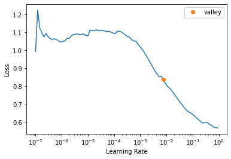
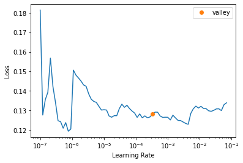

# fastai_object_detection
> Extension for <a href='https://docs.fast.ai'>fastai</a> library to include object recognition.


This package makes some object detection and instance segmentation models available for fastai users by using 
a callback which converts the batches to the required input. 

It comes with a fastai `DataLoader`s class for object detection, prepared and easy to use models and 
some metrics to measure generated bounding boxes (mAP). So you can train a model for object detection 
in the simple fastai way with one of the included learner classes.

## Install

`pip install --upgrade git+https://github.com/rbrtwlz/fastai_object_detection`

## Usage

```
from fastai.vision.all import *
from fastai_object_detection.all import *
```

```
path, df = CocoData.create(ds_name="ds-cats-dogs", cat_list=["cat", "dog"], max_images=1000)
```

    Creating folders.
    Downloading annotation files...
    loading annotations into memory...
    Done (t=15.40s)
    creating index...
    index created!
    Found 2 valid categories.
    ['cat', 'dog']
    Starting download.


    Downloading images of category cat
    Downloading images of category dog
    1947 images downloaded.
    Creating Dataframe...


<div>
    <style>
        /* Turns off some styling */
        progress {
            /* gets rid of default border in Firefox and Opera. */
            border: none;
            /* Needs to be in here for Safari polyfill so background images work as expected. */
            background-size: auto;
        }
        .progress-bar-interrupted, .progress-bar-interrupted::-webkit-progress-bar {
            background: #F44336;
        }
    </style>
  <progress value='1947' class='' max='1947' style='width:300px; height:20px; vertical-align: middle;'></progress>
  100.00% [1947/1947 00:04<00:00]
</div>


```
dls = ObjectDetectionDataLoaders.from_df(df, bs=2, 
                                         item_tfms=[Resize(800, method="pad", pad_mode="zeros")], 
                                         batch_tfms=[Normalize.from_stats(*imagenet_stats)])
```

```
dls.show_batch(figsize=(10,10))
```


```
learn = fasterrcnn_learner(dls, fasterrcnn_resnet50, 
                           opt_func=SGD, lr=0.005, wd=0.0005, train_bn=False,
                           metrics=[mAP_at_IoU40, mAP_at_IoU60])
learn.freeze()
```

    Downloading: "https://download.pytorch.org/models/resnet50-19c8e357.pth" to /root/.cache/torch/hub/checkpoints/resnet50-19c8e357.pth


    


    Downloading: "https://download.pytorch.org/models/fasterrcnn_resnet50_fpn_coco-258fb6c6.pth" to /root/.cache/torch/hub/checkpoints/fasterrcnn_resnet50_fpn_coco-258fb6c6.pth


    


```
learn.lr_find()
```


    SuggestedLRs(valley=0.007585775572806597)





```
learn.fit_one_cycle(3, 7e-03)
```


<table border="1" class="dataframe">
  <thead>
    <tr style="text-align: left;">
      <th>epoch</th>
      <th>train_loss</th>
      <th>valid_loss</th>
      <th>mAP@IoU>0.4</th>
      <th>mAP@IoU>0.6</th>
      <th>time</th>
    </tr>
  </thead>
  <tbody>
    <tr>
      <td>0</td>
      <td>0.146089</td>
      <td>0.139577</td>
      <td>0.700255</td>
      <td>0.680961</td>
      <td>04:10</td>
    </tr>
    <tr>
      <td>1</td>
      <td>0.124023</td>
      <td>0.127337</td>
      <td>0.711020</td>
      <td>0.689231</td>
      <td>04:10</td>
    </tr>
    <tr>
      <td>2</td>
      <td>0.137093</td>
      <td>0.125192</td>
      <td>0.709743</td>
      <td>0.690755</td>
      <td>04:10</td>
    </tr>
  </tbody>
</table>


```
learn.unfreeze()
```

```
learn.lr_find()
```


    SuggestedLRs(valley=0.0003311311302240938)





```
learn.fit_one_cycle(3, 3.3e-04)
```


<table border="1" class="dataframe">
  <thead>
    <tr style="text-align: left;">
      <th>epoch</th>
      <th>train_loss</th>
      <th>valid_loss</th>
      <th>mAP@IoU>0.4</th>
      <th>mAP@IoU>0.6</th>
      <th>time</th>
    </tr>
  </thead>
  <tbody>
    <tr>
      <td>0</td>
      <td>0.145278</td>
      <td>0.125726</td>
      <td>0.716532</td>
      <td>0.691376</td>
      <td>07:11</td>
    </tr>
    <tr>
      <td>1</td>
      <td>0.131795</td>
      <td>0.124033</td>
      <td>0.712802</td>
      <td>0.692319</td>
      <td>07:11</td>
    </tr>
    <tr>
      <td>2</td>
      <td>0.129954</td>
      <td>0.123833</td>
      <td>0.713087</td>
      <td>0.691657</td>
      <td>07:11</td>
    </tr>
  </tbody>
</table>

