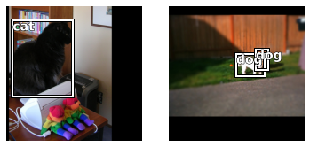

# fastai_object_detection
> Extension for <a href='https://docs.fast.ai'>fastai</a> library to include object recognition.


This package makes some object detection and instance segmentation models available for fastai users by using 
a callback which converts the batches to the required input. 

It comes with a fastai `DataLoader`s class for object detection, prepared and easy to use models and 
some metrics to measure generated bounding boxes (mAP). So you can train a model for object detection 
in the simple fastai way with one of the included learner classes.

## Install

`pip install --upgrade git+https://github.com/rbrtwlz/fastai_object_detection`

## Usage

```
from fastai.vision.all import *
from fastai_object_detection.all import *
```

```
path, df = CocoData.create(ds_name="ds-cats-dogs", cat_list=["cat", "dog"], max_images=2000)
```

    Dataset ds-cats-dogs already exists: /home/user/.fastai/data/ds-cats-dogs


```
dls = ObjectDetectionDataLoaders.from_df(df, bs=2, 
                                         item_tfms=[Resize(800, method="pad", pad_mode="zeros")], 
                                         batch_tfms=[Normalize.from_stats(*imagenet_stats)])
```

```
dls.show_batch()
```





```
learn = fasterrcnn_learner(dls, fasterrcnn_resnet50, 
                           opt_func=SGD, lr=0.005, wd=0.0005, train_bn=False,
                           metrics=[mAP_at_IoU40, mAP_at_IoU60])
```

```
learn.lr_find()
```


<div>
    <style>
        /* Turns off some styling */
        progress {
            /* gets rid of default border in Firefox and Opera. */
            border: none;
            /* Needs to be in here for Safari polyfill so background images work as expected. */
            background-size: auto;
        }
        .progress-bar-interrupted, .progress-bar-interrupted::-webkit-progress-bar {
            background: #F44336;
        }
    </style>
  <progress value='0' class='' max='2' style='width:300px; height:20px; vertical-align: middle;'></progress>
  0.00% [0/2 00:00<00:00]
</div>


<div>
    <style>
        /* Turns off some styling */
        progress {
            /* gets rid of default border in Firefox and Opera. */
            border: none;
            /* Needs to be in here for Safari polyfill so background images work as expected. */
            background-size: auto;
        }
        .progress-bar-interrupted, .progress-bar-interrupted::-webkit-progress-bar {
            background: #F44336;
        }
    </style>
  <progress value='0' class='' max='79' style='width:300px; height:20px; vertical-align: middle;'></progress>
  0.00% [0/79 00:00<00:00]
</div>


```
learn.fit_one_cycle(1, 1e-04)
```
